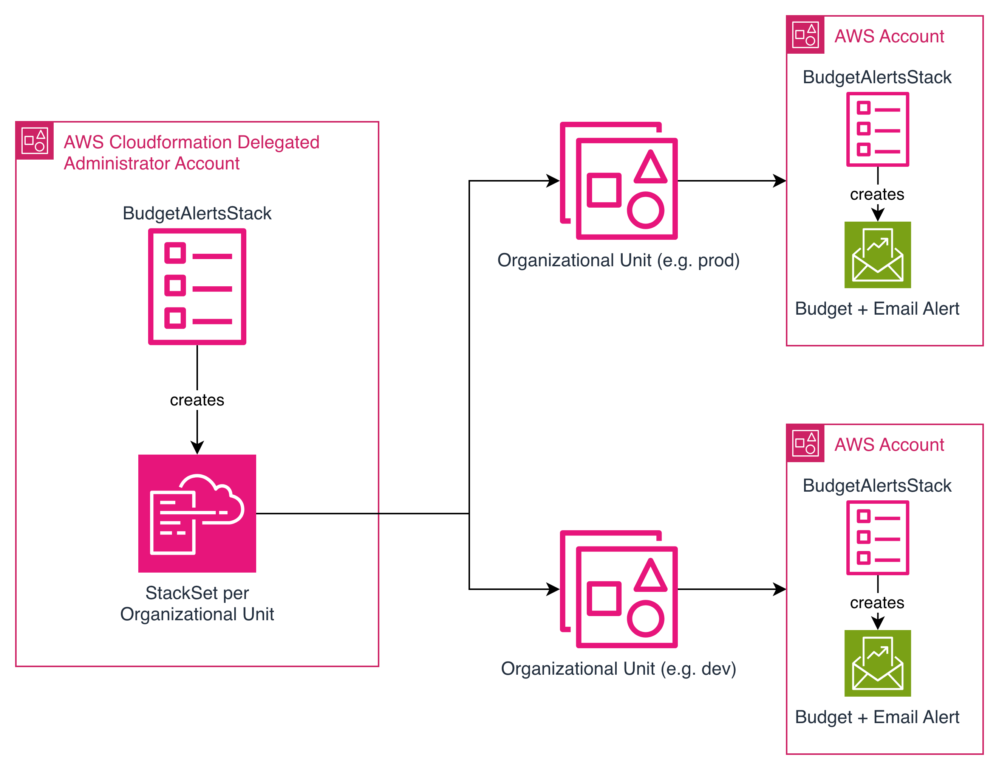

# 📦 Budget Alerts for AWS Organizations

[](https://github.com/superluminar-io/budget-alerts/actions/workflows/lint-and-test.yml)

Automatically deploy budget alerts across your AWS Organization using **service-managed CloudFormation StackSets**, driven by a simple and declarative YAML configuration.

This tool allows you to:

* Define **default budgets** for the entire Organization
* Override budgets for specific OUs
* Automatically compute **homogeneous OU subtrees**
* Deploy budgets into **all accounts** in each subtree
* Keep your config synchronized with your Organization structure
* Use a single CDK stack to control all deployments

Designed for organizations needing consistent, automated cost governance across AWS accounts.

---

# 🔐 Requirements & Prerequisites

Before using this solution, ensure the following are in place.

## 1. Deploy from a CloudFormation **StackSets Delegated Administrator**

You must run:

```bash
npx cdk synth
npx cdk deploy
```

from either:

* the **management account**, or
* an account registered as a **CloudFormation StackSets Delegated Administrator**.

Register a delegated admin:

```bash
aws cloudformation register-delegated-administrator \
  --account-id <ACCOUNT_ID> \
  --service-principal cloudformation.amazonaws.com
```

Verify:

```bash
aws organizations list-delegated-administrators \
  --service-principal cloudformation.amazonaws.com
```

---

## 2. StackSets must use **service-managed permissions**

Required:

* CloudFormation **trusted access** enabled
* A delegated StackSets admin account
* Standard StackSet roles created by CloudFormation:

  * `AWSCloudFormationStackSetAdministrationRole`
  * `AWSCloudFormationStackSetExecutionRole`

Enable trusted access:

```bash
aws organizations enable-aws-service-access \
  --service-principal cloudformation.amazonaws.com
```

---

## 3. IAM permissions required for deployment

### Organizations (read-only)

* `organizations:DescribeOrganization`
* `organizations:ListRoots`
* `organizations:ListOrganizationalUnitsForParent`
* `organizations:ListAccountsForParent`
* `organizations:ListAccounts`

### CloudFormation StackSets

* `cloudformation:*` (or AdministratorAccess)

### Budgets

* `budgets:*`

---

## 4. Valid AWS credentials

Deployment requires valid AWS CLI or AWS SSO credentials on the machine running CDK.

---

## 5. Must be part of the **same AWS Organization**

This solution discovers your Organization, targets OUs, and deploys StackSets.
It cannot run outside an AWS Organization.

---

## 6. OU layout must allow **homogeneous subtrees**

To compute valid homogeneous budget regions:

* Except for the root management account, **all accounts must either**:

  * live in **leaf OUs**, or
  * share the **same effective budget** as the OU they belong to and all its descendants.

If accounts within the same OU subtree require different budgets, you must restructure OUs accordingly.
This tool cannot assign multiple budgets within a single OU subtree.

For more details, see: [visual homogeneous subtrees examples](./docs/homogeneous-subtrees.md).

---

# 🏗 Architecture Overview

This solution automates budget deployment using three core elements:

1. **BudgetAlertsStack**
   A single CDK stack deployed to the CloudFormation Delegated Administrator account.
   It analyzes your Organization, reads the configuration, and produces the required StackSets.

2. **StackSet per Homogeneous Subtree**
   The root stack creates **one StackSet per homogeneous budget subtree**.
   Each StackSet targets a specific OU and will deploy to all accounts inside it.

3. **Per-Account BudgetAlertsStack Instances**
   Each StackSet deploys a minimal stack to each account in the target OU:

   * An AWS Budget
   * An email alert subscription

The architecture diagram (see image) illustrates this high-level structure:
A centralized orchestrating stack → stacksets per OU subtree → per-account deployments.



---

# 🔄 How It Works

This section summarizes the runtime behavior of the system.

### 1. **Discover the AWS Organization**

During `cdk synth` / `cdk deploy`, the tool:

* Retrieves the Organization root
* Enumerates all Organizational Units
* Builds a proper hierarchical OU tree

This ensures deployments always reflect the real structure of your Organization.

---

### 2. **Load & Validate the Configuration**

The tool loads:

```
budget-config.yaml
```

It:

* Applies the default budget
* Applies OU-level overrides
* Validates that all referenced OUs exist
* Ensures every OU subtree is budget-consistent
* Enforces the homogeneous subtree prerequisite

---

### 3. **Compute Homogeneous Subtrees**

A *homogeneous subtree* is an OU subtree where every OU and account has the **same effective budget**.

This step determines the **minimal set of OUs** that require separate StackSets.

Example:

* If `prod/` has a single budget → 1 StackSet
* If `dev/` uses a different budget → 1 StackSet
* If a subtree has overrides deeper inside → it splits into multiple StackSets

This gives you:

* Correct propagation of budget rules
* Minimal number of StackSets
* No conflicting budgets inside a subtree

---

### 4. **Create a StackSet per Homogeneous Subtree**

For each subtree, the root stack creates a **service-managed CloudFormation StackSet** targeting the subtree’s root OU.

Each StackSet deploys the per-account budget stack to **every account** inside that OU, including future accounts added to it.

Result:

* Fully automated, organization-wide budget rollouts
* Consistent budget settings
* No repeated manual deployments

---

# 🚀 Quick Start

## 1. Create an empty project

```bash
mkdir my-budgets
cd my-budgets
npm init -y
```

## 2. Install required packages

```bash
npm install --save-dev budget-alerts aws-cdk-lib constructs cdk-stacksets
```

---

# 🧩 Initialize configuration

Generate the initial config and CDK setup:

```bash
npx budget-alerts-init-config
```

This creates:

```
budget-config.yaml
cdk.json
```

The generated `cdk.json` automatically sets:

```json
{
  "app": "npx budget-alerts",
  "context": {
    "budgetConfigPath": "budget-config.yaml"
  }
}
```

---

# ✏️ Edit `budget-config.yaml`

Example:

```yaml
default:
  amount: 10
  currency: EUR

organizationalUnits:
  ou-aaaa1111:
    amount: 25
  ou-bbbb2222:
    amount: 50
```

---

# 🔄 Keep the config in sync

```bash
npx budget-alerts-init-config
```

With prune:

```bash
npx budget-alerts-init-config --prune
```

This will:

* Add new OUs
* Remove OUs no longer in the Organization
* Preserve your budget values
* Update descriptive YAML comments

---

# ⚙️ Bootstrap (first time only)

```bash
npx cdk bootstrap
```

---

# 🚢 Deploy budgets

```bash
npx cdk deploy
```

CDK will:

* Discover your Organization
* Validate your configuration
* Compute homogeneous budget subtrees
* Create one StackSet per subtree
* Deploy budgets to all matching accounts

---

# 🔍 Dry-run without deploying

```bash
npx cdk synth
```

This performs:

* Org discovery
* Configuration validation
* Subtree computation
* StackSet synthesis

No AWS resources are created.

---

# 🧼 Cleanup

Remove all deployed resources:

```bash
npx cdk destroy
```

This removes:

* The central BudgetAlertsStack
* All generated StackSets
* All per-account budget stacks
* All AWS Budgets created by them

---

# 🤝 Support

This project is maintained by **superluminar GmbH**.
If you need help integrating automated budget governance or AWS Organizations tooling, feel free to contact us.
